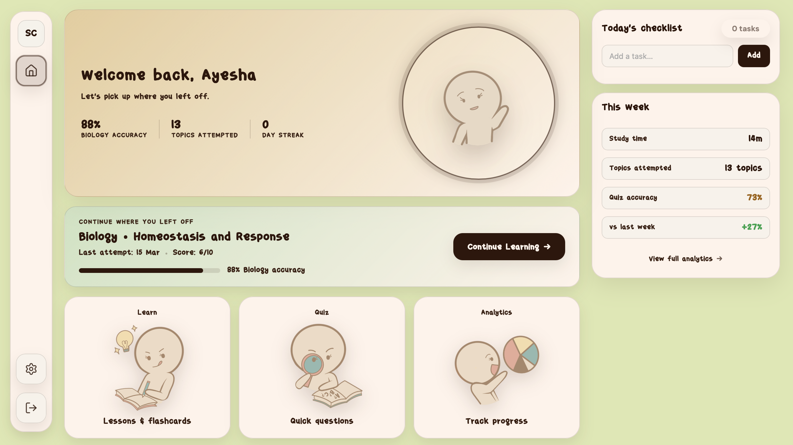
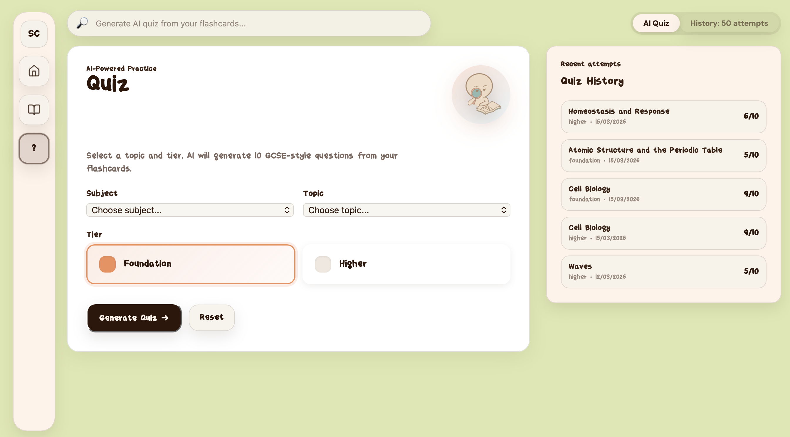
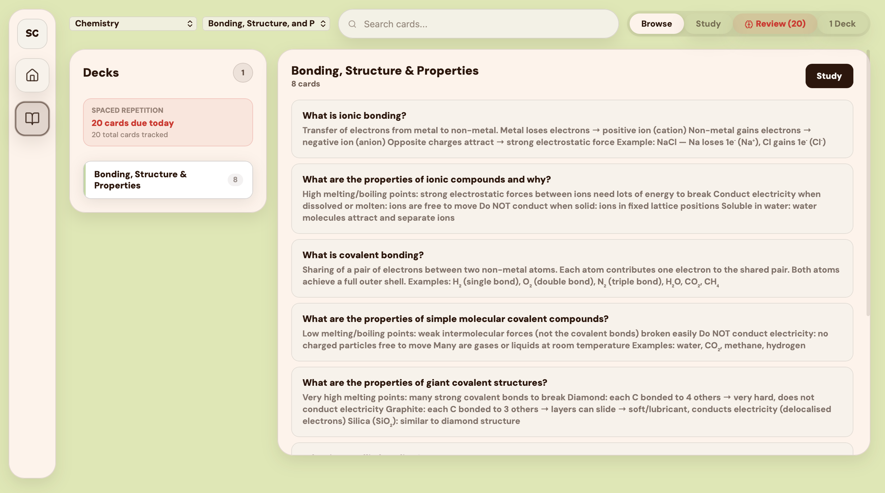
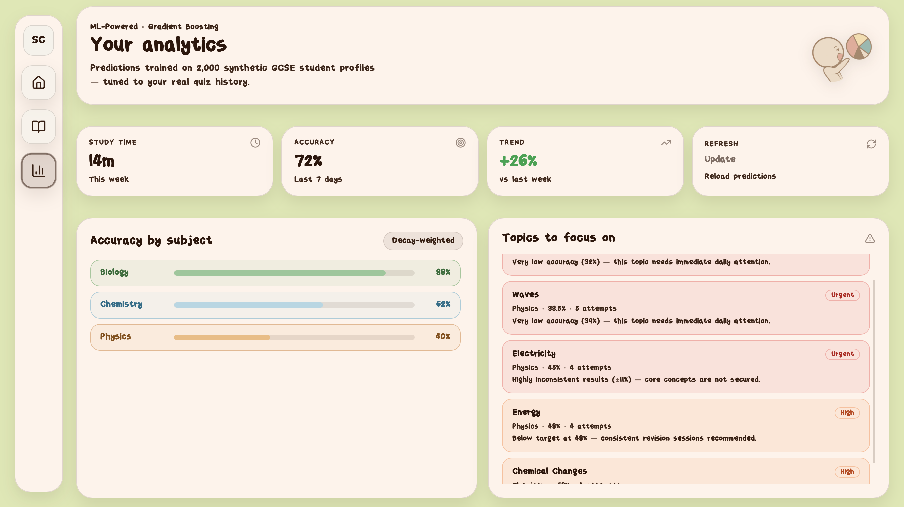
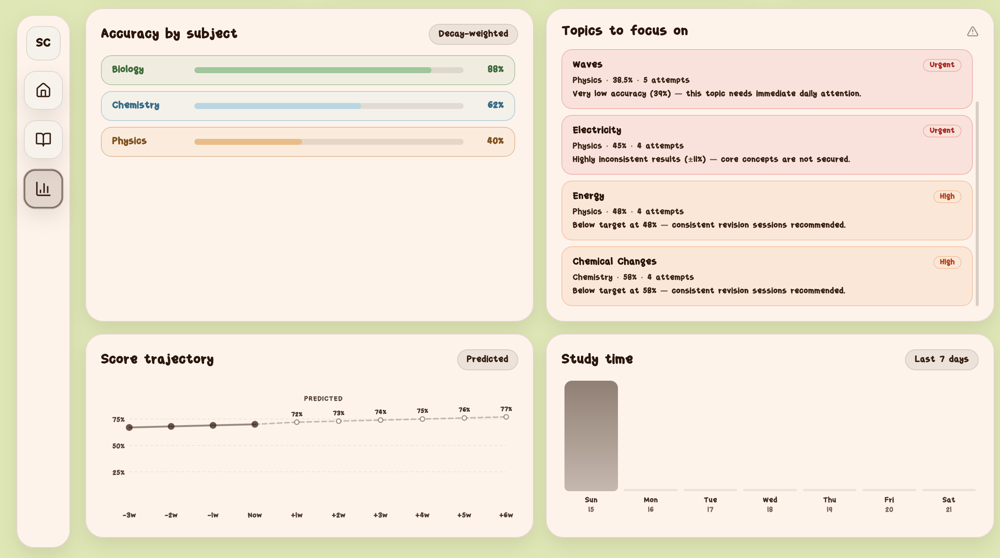

# Study Companion App

## Live Demo

https://study-companion-topaz.vercel.app

Test Account:
Email: shah.hussain.2@city.ac.uk
Password: Marking2026

---

## Overview

The Study Companion App is an AI-powered web-based learning system designed to support students through personalised study tools, including flashcards, spaced repetition, quizzes, and analytics.

The system uses a React frontend and a Node.js/Express backend, with a MySQL database for persistent storage. AI functionality is integrated using the Anthropic API.

---

## Key Highlights

- AI-generated quizzes using Claude Sonnet
- SM-2 spaced repetition algorithm
- Machine learning-based performance prediction
- Full-stack deployment (Vercel + Railway)

---

## Screenshots

### Dashboard


### Quiz Interface


### Flashcards


### Analytics




---

## Features

- **Flashcards** — Create and study decks organised by subject and topic
- **Spaced Repetition** — SM-2 algorithm automatically schedules cards for review based on performance
- **AI-Powered Quizzes** — Generate GCSE-style multiple choice questions from your flashcard content using Claude
- **Analytics** — ML-powered score predictions and study time tracking
- **Progress Tracking** — View quiz history, accuracy by subject, and weak topics

---

## Tech Stack

| Layer | Technology |
|---|---|
| Frontend | React (Vite) |
| Backend | Node.js + Express |
| Database | MySQL (mysql2/promise) |
| Authentication | JWT + bcrypt |
| AI Integration | Anthropic API (Claude Sonnet) |
| ML / Analytics | Python (Flask API for prediction models) |
| Frontend Hosting | Vercel |
| Backend & DB Hosting | Railway |

---

## System Architecture

The application follows a client-server architecture:

- React frontend communicates with the Node.js backend via REST APIs
- Backend handles business logic, authentication, and AI integration
- MySQL database stores persistent data
- Flask ML service provides analytics predictions

---

## Project Structure

```
study-companion/
├── frontend/         # React (Vite) app
│   └── src/
│       ├── pages/    # FlashcardsPage, QuizPage, AnalyticsPage, etc.
│       ├── assets/   # Images and mascots
│       └── api.js    # API helper functions
├── server/           # Node.js + Express backend
│   ├── server.js     # Main server file (all routes)
│   └── ML/           # Flask ML server for analytics
└── README.md
```

---

## Getting Started

### Prerequisites

- Node.js 18+
- MySQL database
- Anthropic API key
- Python 3.9+ (for ML server)

### Installation

```bash
# Install root dependencies
npm install

# Install frontend dependencies
cd frontend && npm install

# Install backend dependencies
cd ../server && npm install
```

### Running Locally

```bash
# Start the backend
cd server && node server.js

# Start the frontend (in a separate terminal)
cd frontend && npm run dev
```

---

## Deployment

- **Frontend** — Deployed on [Vercel](https://study-companion-topaz.vercel.app)
- **Backend** — Deployed on Railway (REST API)
- **Database** — MySQL instance on Railway
- **ML Server** — Flask app deployed as a separate Railway service

---

## API Endpoints

### Auth
| Method | Endpoint | Description |
|---|---|---|
| POST | `/api/auth/signup` | Register a new user |
| POST | `/api/auth/login` | Login and receive JWT |

### Flashcards
| Method | Endpoint | Description |
|---|---|---|
| GET | `/api/decks` | Get all decks |
| POST | `/api/decks` | Create a deck |
| GET | `/api/decks/:id/cards` | Get cards in a deck |

### Quiz
| Method | Endpoint | Description |
|---|---|---|
| POST | `/api/quiz/generate` | Generate AI quiz from flashcards |
| GET | `/api/quiz/:id` | Get quiz by ID |
| POST | `/api/quiz/:id/submit` | Submit quiz answers |
| GET | `/api/quiz/history/me` | Get current user's quiz history |

### Spaced Repetition
| Method | Endpoint | Description |
|---|---|---|
| GET | `/api/review/due` | Get cards due for review today |
| POST | `/api/review/:cardId` | Submit a review rating (SM-2) |
| GET | `/api/review/stats` | Get review stats for current user |
| POST | `/api/review/add/:cardId` | Add a card to the review queue |

### Analytics
| Method | Endpoint | Description |
|---|---|---|
| POST | `/api/analytics/predict` | Get ML-powered score predictions |

---

## Authentication

All protected routes require a `Bearer` token in the `Authorization` header:

```
Authorization: Bearer <your_jwt_token>
```

Tokens are issued on login/signup and expire after 7 days.

---

## Future Work

- Adaptive learning based on user performance
- Mobile application version
- Enhanced AI tutoring capabilities
- Improved recommendation system

---

## License

This project was built as a student study tool. All rights reserved.